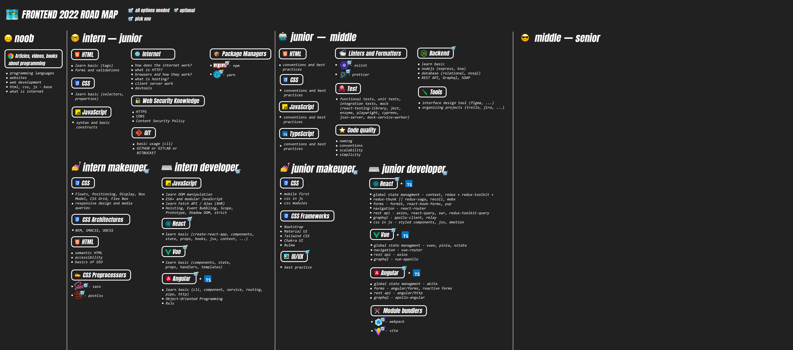

# 🗺️ Roadmap Front-end 2022. Что учить в 2022 ?

Как стать frontend разработчиком в 2022 году, какие технологии выбрать ? Какой стек и какие библиотеки учить на уровне intern, junior, middle, senior ? В данном видео отвечаем на данные вопросы. Данное видео будет полезно новичкам, а также уже сформировавшимся специалистам. Данное видео даст понимание по поводу актуальности технологий frontend'а в 2022

## Видео

# 👇 Roadmap

[]

## Социальные сети

- :comet: &nbsp;**[Github](https://github.com/debabin)**
- :airplane: &nbsp;**[Telegram](https://t.me/techdnevnik)**
- :popcorn: &nbsp;**[Youtube](https://www.youtube.com/channel/UCYimO7BCUwdGiaCXlwG-rLw)**
- :bird: &nbsp;**[Twitter](https://twitter.com/db_dzo)**
- :camera: &nbsp;**[Instagram](https://www.instagram.com/db_babin/)**
- :robot: &nbsp;**[Discord](https://discordapp.com/users/181376683046076416/)**
